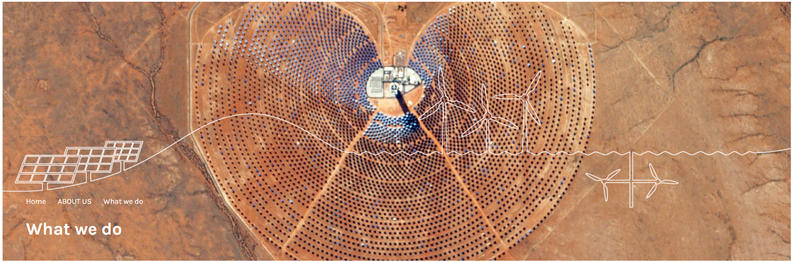
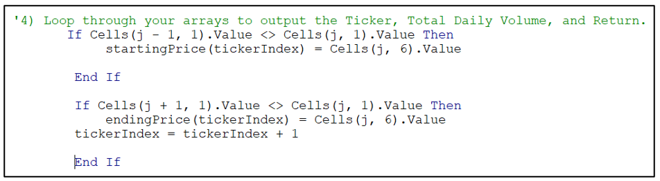
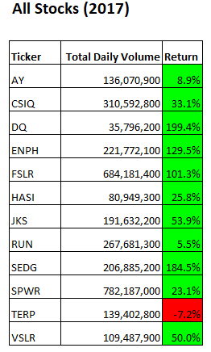
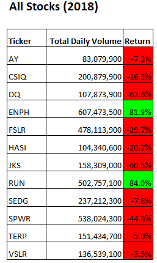

Gemasolar is a concentrated solar power plant with a molten salt heat storage system. It is located within the city limits of Fuentes de Andalucía in the province of Seville, Spain and generates enough power for 27,500 households per year.
The above image is an example of the newest form of energy being developed currently. Investors hungry for high producing stocks is the funding source for the research and development being done by ground-breaking solar energy companies like this one. For information about this solar power plant that was dedicated in October 2011: [Gemasolar](https://en.wikipedia.org/wiki/Gemasolar_Thermosolar_Plant).

# MODULE-2-VBA: Stock Analyses using VBA Excel Macro #

## I. Overview of Project ##
Steve's parents have been investing since 2017 in a "green" company that they felt was the best investment. Steve, on the other hand, is not certain that they had all the facts at hand to make a good determination. He asked for help in analyzing whether their investment plan was appropriately set on the best company which would give the highest rate of return over time. The company Steve's parents chose has the NYSE ticker or stock symbol "DQ" (DAQO New Energy Corp.). They had chosen this company because it produces "green" energy which they are highly interested in. Their goal is to support sustainable energy sources that do not affect the environment negatively. To broaden Steve's parent's perspectives, it was not enough to just compare DQ's returns for 2017 and 2018. Calculating the stock performance by using the annualized Total Return will show the financial gain (or loss) in their stock price. Also, investigating any external influences on the solar power set of companies is needed. Using this data for both 2017 and 2018 will depict a more broad picture of the growth potential for solar energy products across all 12 companies, including DQ.

## II. Results ##
As mentioned above, there are two characteristics we will be analyzing across all 12 companies:

1. The Total Return of the stocks was collected daily and included in the provided database. Taking each price at the end of trading and subtracting the next day's ending price at the end of the day was compiled across the entire year for each stock. This number was converted to a percentage and placed in the tables below for each year showing the gains (cell background is green) and losses (cell background is red) for each company. 
2. As an aside, We also need to see the performance of the annualization macros by 2 methods of calculation used, i.e., running the calculations linearly (calculating each company's numbers, one at a time) and using a method with embedded arrays to calculate each characteristic all at once across all 12 companies. This will help us develop another macro with even more years of data if needed to further analyze what we are seeing across these companies.

### A. How the Analyses Were Completed: Daily Closing Stock Prices ###

From the provided database, we analyzed stock prices across 12 solar energy companies for 2 years (2017 and 2018). The calculations to obtain the Annual Return were based on subtracting the Closing price from the previous day from the Closing stock price from the current day of trading for each of these years. Here is the portion of the macro code which calculated these numbers (Note: there is an index counter in use in order to keep track of each days' calculations. Also, the hard-coded "6" is actually the column where the Closing prices are located in the database.)

***2017 "ANNUAL RETURN" RESULTS***

The results are listed below and are augmented by cell background colors to quickly show GAINS (green cells) and LOSSES (red cells). From the years 2017 and 2018 for the 12 companies, you can see in these tables that 2017 was a banner year for solar power companies. Almost all of the companies enjoyed a positive total return on their shares. 

The table below gives the ticker names, full names of companies and top 3 highest returns from the 2017 table above.  

| Return % | Rank | Ticker | Full Company Name |
|----------|------|--------|--------------------|
| | | AY |Atlantica Sustainable Infrastructure |
|   |   | SIQ | Canadian Solar Inc. |
| 199.4% | #1 | DQ | DAQO New Energy Corp.|
| 129.5% | #3 | ENPH |Enphase Energy Inc.|
| | | FSLR | First Solar Inc.|
| | | HASI | Hannon Armstrong Sustainable Infrastruture Capital Inc.|
| | | JKS  | JinkoSolar Holding Co. Ltd.|
| | | RUN  |SunRun Inc.|
| 184.5% | #2 | SEDG |SolarEdge Techologies, Inc.|
| | | SPWR |SunPower Corp.|
| | | TERP |TerraForm Power Operating, LLC|
| | | VSLR |Vivint Solar|

As mentioned above, we further investigated the huge returns. This fact begs the question about what was happening business-wise that would cause 11 out of 12 solar energy companies to post such high gains. For the top 3 companies, this information was found online and is paraphrased below:

For the "wide" view of stock performance, "Renewable energy once again achieved record increases in capacity in 2017," (from [Green_Tech_Media.com](https://www.greentechmedia.com/articles/read/2017-another-record-busting-year-for-global-renewable-energy-capacity). From another, well-respected source, REN21 is the only global renewable energy community of scientists, governments, NGOs and industrial experts providing insights into the need of renewable energy. They provide up-to-date and peer-reviewed facts, figures and analysis of global developments in technology, policies and markets. Their goal is to enable decision-makers around the world to make the shift to renewable energy happen – now before it is too late. From: [REN21](https://www.ren21.net/about-us/who-we-are/)

**#1 - "DQ" (Daqo New Energy Corp.)** is a Chinese company engaged in the manufacture of monocrystalline silicon and polysilicon, primarily for use in solar photovoltaic systems. The company operates a mono-Si and poly-Si manufacturing facility located in Shihezi, Xinjiang Province, China. ... DAQO formerly manufactured silicon wafers at a facility in Chongqing, China **(discontinued in 2018)**. From: [DQ_Wikipedia_Pages](https://en.wikipedia.org/wiki/Daqo_New_Energy).

**#2- SEDG (SolarEdge Technologies, Inc.)** is an American Israeli provider of power optimizer, solar inverter and monitoring systems for photovoltaic arrays.These products aim to increase energy output through module-level Maximum Power Point Tracking (MPPT).[2] Established in 2006, the company has offices in the United States,[3] Germany,[4] Italy, Japan, and Israel. In May 2015, SolarEdge partnered with Tesla Motors[9] for the joint development of a photovoltaic (PV) storage and backup power solution for the residential solar market, based on the Powerwall home and industrial battery packs that were unveiled in April 2015,[10] and quickly received orders to a total value of US$800 million. In October 2018, SolarEdge announced agreements to acquire a major stake in Kokam, a South Korean provider of Lithium-ion battery cells, batteries and energy storage solutions. Using SolarEdge's direct current (DC) optimized inverter and Tesla's automotive-grade battery technology, the solution requires only a single SolarEdge inverter to manage both PV and storage functions. The system is designed for efficient, outdoor installation and includes remote monitoring and troubleshooting to keep operations and maintenance costs low. In October 2020, SolarEdge has partnered with Schneider Electric. This alliance is planned to provide a cohesive electricity environment for installers and device owners, while also accelerating solar installation experience across the region. From [SEDG_Wikipedia_Pages](https://en.wikipedia.org/wiki/SolarEdge).

**#3 - ENPH (Enphase Energy Inc.)** is an American NASDAQ-listed energy technology company headquartered in Fremont, California. Enphase designs and manufactures software-driven home energy solutions that span solar generation, home energy storage and web-based monitoring and control. Enphase has shipped about thirty million solar microinverters, primarily into the residential and commercial markets in North America, Europe and Australia. Microinverters convert the direct current power from the solar panel (DC) directly into grid-compatible alternating current (AC) for use or export. Enphase was the first company to successfully commercialise the microinverter on a wide scale, and remains the market leader in their production. 2017 began the introduction of the new IQ architecture, which uses a new cabling system. Two conductors, down from four, are integrated and compliant with electrical codes due to the use of GFCI, no need for a neutral and no conductive materials in the enclosure. The initial products were the IQ6 and IQ6+, followed in 2018 by the IQ7. In 2019 the IQ8 series will enable continuous power production during grid outages during daytime without the need for batteries. From: [ENPH_Wikipedia_Pages](https://en.wikipedia.org/wiki/Enphase_Energy).

***2018 "ANNUAL RETURN" RESULTS***

The results are listed below and are augmented by cell background colors to quickly show GAINS (green cells) and LOSSES (red cells). As said above, 2017 was a great year for solar stocks but 2018 was another story. The turn around is that almost all of the companies in 2018 accummulated a loss in their stock prices for the year. It must have been a real "slap in the face" to see the results of 2018 trading! See the tables below.

The table below gives the rank of the top 2 positive returns together with their ticker names and their full company names of the 12 selected companies analyzed across 2017 and 2018.  

| Return % | Rank | Ticker | Full Company Name |
|----------|------|--------|--------------------|
| | | AY |Atlantica Sustainable Infrastructure |
| |  | SIQ | Canadian ASolar Inc. |
| |  | DQ | DAQO New Energy Corp.|
| 81.9% | #2 | ENPH |Enphase Energy Inc.|
| | | FSLR | First Solar Inc.|
| | | HASI | Hannon Armstrong Sustainable Infrastruture Capital Inc.|
| | | JKS  | JinkoSolar Holding Co. Ltd.|
| 84.0% | #1 | RUN  |SunRun Inc.|
| | | SEDG |SolarEdge Techologies, Inc.|
| | | SPWR |SunPower Corp.|
| | | TERP |TerraForm Power Operating, LLC
| | | VSLR |Vivint Solar|

As mentioned above, we further investigated why there was such a big drop in returns compared to 2018. Several things happened to the market in 2018. "...Stocks plummeted 20% in a move that caught solar investors off guard. The plunge was caused by China cutting solar incentives for the rest of 2018, which could reduce the country's solar installations by 30%-40% in 2018...a **big deal** considering China installed about half of all solar panels worldwide in 2018." From: [Why-first-solar-stock-dropped-20%](https://www.fool.com/investing/2018/06/12/why-first-solars-stock-dropped-20-in-a-week.aspx) However, there are 2 companies (ranked in the above table) who fared better than the 10 other companies. This information was found online and is paraphrased below:

**#1 - RUN (Sunrun Inc.)** RUN had the highest return (84.0%). They are "an American provider of residential solar panels and home batteries, headquartered in San Francisco, California. In July 2018, Sunrun expanded their solar and battery service to the island of Puerto Rico. With operations in 23 states, the District of Columbia, and Puerto Rico, Sunrun became the largest solar, storage and energy services company in America, surpassing Solar City". From: [Sunrun_Wikipedia_
pages](https://en.wikipedia.org/wiki/Sunrun) 

**#2 - ENPH (Enphase Energy Inc.)**  ENPH had the second highest return (81.9%) across all 12 companies examined herein. "Enphase Energy in 2017 began the introduction of the new IQ architecture, which uses a new cabling system. Two conductors, down from four, are integrated and compliant with electrical codes due to the use of GFCI, no need for a neutral and no conductive materials in the enclosure. The initial products were the IQ6 and IQ6+, followed in 2018 by the IQ7. In 2019 the IQ8 series will enable continuous power production during grid outages during daytime without the need for batteries." From: [Enphase_Wikipedia_Pages](https://en.wikipedia.org/wiki/Enphase_Energy) 

Of the remaining companies, the one with the least amount of loss was SolarEdge which with a 7.8% drop in their returns for 2018. Impacting their business plans was the announcement in October 2018 agreements to acquire a major stake in Kokam, a South Korean provider of Lithium-ion battery cells, batteries and energy storage solutions.
At the bottom of the pile is DQ (DAQO New Energy Corp.) which is the subject of this analysis. They show a loss of almost 63% in 2018! As noted above in the 2017 returns paragraph for DQ, this is a Chinese company. In the business-climate analysis for 2018, China discontinued an incentive for the manufacture of solar photovoltaic systems. One of DQ's major plants shutdown the manufacture of this component in 2018 which negatively impacted stock returns. From: [DQ_Wikipedia_Pages](https://en.wikipedia.org/wiki/Daqo_New_Energy)

### B. How the Analyses Were Completed: Runtimes for Re-factorer Analysis Macro ###

See the figures below to see differing run times for each year of data.

Before revising the current macro to run on the database(s), the previous macro collected the two datapoints separately for each company, i.e., first obtaining the Annual Return for each company, one at a time, and then, separately summing up the total annual volume of stock sales. The runtime was much higher than the above in this calculation method.

## III. Summary ##

### Recommendation to Steve on Informing His Parents of the Data Analysis Outcomes ###

There are very clear choices that will, based on the last 2 years of data, produce a more informed path for Steve's parents to take in their next investment(s).

***IS DQ a good company to invest in?***
It appears at the outset that Steve's parents looked at the year-end return on DQ's stocks and decided to invest in this company. This was, of course, the company with the highest return compared to the other 11 companies.  However, if they had continued to study their options, they would have seen an almost 63% drop in DQ's return for the next year (2018).

***What is the general makeup of all other companies providing good returns?***
1. It appears that the better faring companies who had a wider sales area (see RUN in "2018 Results") did better in the long run across the 2 years of data we had.
2. Companies who concentrated on manufacturing and distributing components of solar panels appeared to have a better advantage to sail through the storm of 2018 (see ENPH in "2018 Results").

### Recommendations concerning the Refactoring Macro Code in this File ###

***What are the advantages or disadvantages of using refactoring macro code?***
1. **Advantages** toward refactoring code lay in running analysis on arrays rather than individual company data. 
(a) It will minimize the run time of the macro by running all analysis tasks at once rather than individually; and 
(b) it will be easier to add more years of data across the same companies by re-using macro code with the use of "For" loops based on how the macro discovers the total row length of the indivudal years' databases.
2. **Disadvantages** against using refactoring code to run this analysis is:
(a) when new data (or years) will be added, due to the structure of the database, the numbers will have to be placed in a separate tab by year which will increase the size of the database file; and
(b) a higher rated processor may be needed with the more data that is added. See the figures below to see differing run times for each year of data.

The differing times can be explained by my laptop "learning" the macro run after the first run done on 2017 data and minimizing statements' running in the next year. Also, consider these other pieces of information about the environment that this macro ran on: (a) the age of my laptop, i.e., a 2015 Dell laptop, (b) lower-capacity processor on the motherboard of the laptop, and (c) the number of applications running on the laptop impacting the total available memory to aid in running these calculations. Yes, you can (by hand) disable those applications from running in the background but you would not necessarily want to disable some, i.e., Norton Antivirus and Windows constantly checking for security updates. (These two are memory hogs!)

The **overall recommendation** based on the 2 years of data and the macro composition is to:
1. Obtain data across all similar solar power companies, i.e., grouped by improvements in manufacturing components and by companies who have the biggest sales areas.
2. Widen the scope across several more years and observe the rate of returns to find similarities.
3. Diversify the investment across several companies rather than using the "Put all your eggs in one basket" philosophy.
4. Watch the climate of the solar industry by obtaining the newsletters quoted at the beginning of this article. If needed, pull investments out when or if reports are predicting poor returns and/or a coming big downturn.

These steps will only improve the knowledge of solar power and the agileness of these two investors to ... ***"Know when to hold 'em, and know when to fold 'em"!!***

