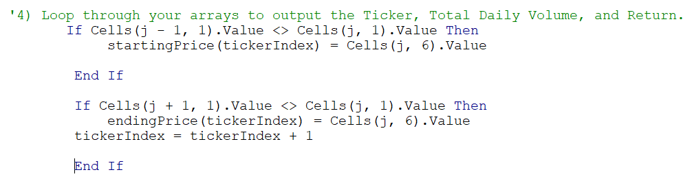

Gemasolar is a concentrated solar power plant with a molten salt heat storage system. It is located within the city limits of Fuentes de Andalucía in the province of Seville, Spain and generates enough power for 27,500 households per year.
The above image is an example of the newest form of energy being developed currently. Investors hungry for high producing stocks is the funding source for the research and development being done by ground-breaking solar energy companies like this one. For information about this solar power plant that was dedicated in October 2011: [Gemasolar](https://en.wikipedia.org/wiki/Gemasolar_Thermosolar_Plant).

# MODULE-2-VBA: Stock Analyses using VBA Excel Macro

## Overview of Project
Steve's parents have been investing since 2017 in a "green" company that they felt were the best investment. Steve, on the other hand, is not certain that they had all the facts at hand to make a good determination. He asked for help in analyzing whether their investment plan was appropriately set on the best company. The company Steve wants me to focus on has the NYSE ticker or stock symbol "DQ" (DAQO New Energy Corp.). Steve's parents had chosen this company because it produces "green" energy which they are highly interested in. Their goal is to support sustainable energy sources that do not affect the environment negatively. We are attempting to broaden their perspective by analyzing and comparing stock performance and total trading volume in 2017 and 2018 across 11 other companies.

## Results - TO DO: Using images and examples of your code, compare the stock performance between 2017 and 2018, as well as the execution times of the original script and the refactored script.

The analysis is well described with screenshots and code (4 pt).

We used stock prices from the years 2017 and 2018 for the 12 companies, including "DQ".

Below are the tables listing the annual Total Volume of stocks traded. Also, the annual return (gains or losses) for each company. 

 

so you loop through the data one time and collect all of the information. Your refactored code should run faster than it did in this module. DO TIMER on old codemeasure performance

Finally, run the stock analysis, then confirm that your stock analysis outputs for 2017 and 2018 are the same as they were in the module (as shown in the images below). In your Resources folder, save the pop-up messages showing elapsed run time for the refactored code as VBA_Challenge_2017.png and VBA_Challenge_2018.png. Then, save the changes to your workbook.

The table is a lot easier to read now, but it's still difficult to determine at a glance which stocks performed well and which ones did not. Let's format our data so that Steve can determine stock performance at a glance.

Daqo dropped over 63% in 2018—yikes! Steve will definitely want to offer some better stocks to his parents.

2017 stock performance

AY-Atlantica Sustainable Infrastructure
CSIQ-Canadian Solar Inc.
#1 - DQ-DAQO New Energy Corp. 199.4% return! 2017
#3 - ENPH-Enphase Energy Inc. 129.5% 2017
FSLR-First Solar Inc.
HASI-Hannon Armstrong Sustainable Infrastruture Capital Inc.
JKS-JinkoSolar Holding Co. Ltd.
RUN-SunRun Inc.
#2 - SEDG-SolarEdge Techologies, Inc. 184.5% return 2017
SPWR-SunPower Corp.
TERP-TerraForm Power Operating, LLC
VSLR-Vivint Solar

The Return column has all positive gains in stock price except for TERP (Terraform). It begs the question about what was happening business-wise that would cause 11 out of 12 solar energy companies to post gains. For the top 3 companies, this information was found online.

**Terraform** - only company that is not wholly providing equipment or components for solar power. 

This company is a subsidiary of SunEdison which has had financial troubles (including having to file for Chapter 11) since April 2016. In July 2017, the U.S. Bankruptcy Court[120] approved SunEdison's bankruptcy-exit plan and it eventually emerged from bankruptcy December 29, 2017. "TerraForm Power is a global renewable energy project development company. It owns and operates solar and wind generation assets serving utility, commercial, and residential customers. It owns and operates over 200 solar power projects. Its scope extends to other clean power generation such as natural gas, geothermal, hydro-electricity, and hybrid power generation." from https://en.wikipedia.org/wiki/SunEdison

"Renewable energy once again achieved record increases in capacity in 2017," (from https://www.greentechmedia.com/articles/read/2017-another-record-busting-year-for-global-renewable-energy-capacity)

REN21 is the only global renewable energy community of actors from science, governments, NGOs and industry. We provide up-to-date and peer-reviewed facts, figures and analysis of global developments in technology, policies and markets. Our goal: enable decision-makers to make the shift to renewable energy happen – now. from: https://www.ren21.net/about-us/who-we-are/

#1 - "DQ" (Daqo New Energy Corp.) is a Chinese company engaged in the manufacture of monocrystalline silicon and polysilicon, primarily for use in solar photovoltaic systems. The company operates a mono-Si and poly-Si manufacturing facility located in Shihezi, Xinjiang Province, China. ... DAQO formerly manufactured silicon wafers at a facility in Chongqing, China (discontinued in 2018) from: [DQ Wikipedia Pages](https://en.wikipedia.org/wiki/Daqo_New_Energy).

#2- SEDG (SolarEdge Technologies, Inc.) is an American Israeli provider of power optimizer, solar inverter and monitoring systems for photovoltaic arrays.These products aim to increase energy output through module-level Maximum Power Point Tracking (MPPT).[2] Established in 2006, the company has offices in the United States,[3] Germany,[4] Italy, Japan, and Israel. In May 2015, SolarEdge partnered with Tesla Motors[9] for the joint development of a photovoltaic (PV) storage and backup power solution for the residential solar market, based on the Powerwall home and industrial battery packs that were unveiled in April 2015,[10] and quickly received orders to a total value of US$800 million. In October 2018, SolarEdge announced agreements to acquire a major stake in Kokam, a South Korean provider of Lithium-ion battery cells, batteries and energy storage solutions. Using SolarEdge's direct current (DC) optimized inverter and Tesla's automotive-grade battery technology, the solution requires only a single SolarEdge inverter to manage both PV and storage functions. The system is designed for efficient, outdoor installation and includes remote monitoring and troubleshooting to keep operations and maintenance costs low. In October 2020, SolarEdge has partnered with Schneider Electric. This alliance is planned to provide a cohesive electricity environment for installers and device owners, while also accelerating solar installation experience across the region. from https://en.wikipedia.org/wiki/SolarEdge.

ENPH-Enphase Energy Inc. Enphase Energy is an American NASDAQ-listed energy technology company headquartered in Fremont, California. Enphase designs and manufactures software-driven home energy solutions that span solar generation, home energy storage and web-based monitoring and control. Enphase has shipped about thirty million solar microinverters, primarily into the residential and commercial markets in North America, Europe and Australia.[3] Microinverters convert the direct current power from the solar panel (DC) directly into grid-compatible alternating current (AC) for use or export.[4] Enphase was the first company to successfully commercialise the microinverter on a wide scale, and remains the market leader in their production. 2017 began the introduction of the new IQ architecture, which uses a new cabling system. Two conductors, down from four, are integrated and compliant with electrical codes due to the use of GFCI, no need for a neutral and no conductive materials in the enclosure. The initial products were the IQ6 and IQ6+, followed in 2018 by the IQ7. In 2019 the IQ8 series will enable continuous power production during grid outages during daytime without the need for batteries. from: https://en.wikipedia.org/wiki/Enphase_Energy

## Summary - TO DO: In a summary statement, address the following questions.
What are the advantages or disadvantages of refactoring code?
How do these pros and cons apply to refactoring the original VBA script?

There is a detailed statement on the advantages and disadvantages of refactoring code in general (3 pt).
There is a detailed statement on the advantages and disadvantages of the original and refactored VBA script (3 pt).

There are very clear choices that will, based on the last 2 years of data, produce a nice return for Steve's parents.

 11 other companies with a similar business focus, i.e., implementation and innovation of solar panel components.

## Results 
We collected stock prices across 12 solar energy companies for 2 years (2017 and 2018). The returns were calculated by using the Closing stock price for each day of trading for each of these years. Here is the portion of the macro code which calculated these numbers.

Also, we were able to sum up the Total Daily Volume for each stock on days of trading for 2017 and 2018. Please see the finished tables below showing the annual return as well as the Total Daily Volume for each stock. Please note the stocks that are colored green. This means the return had increase through the year. The red cells show a loss in the price of the stocks.
  

'''''''ut in Subheadings too.IS DQ a good company to invest in? Daqo dropped over 63% in 2018—yikes! Steve will definitely want to offer some better stocks to his parents.
The macro compiled for these tables used an array of values, meaning that the calculations for the returns as well as the Total Volume were calculated at the same time while running through the code. This is a more efficient way of running any code that has many lines of numbers. Each year had prices and Volumes for all 3,012 stocks. In looking at the time it took to execute the code for 2017, it took over 77 seconds. For 2018, it took over 74 seconds. See below.
  

It should be much lower than these figures so I took the opportunity to run this same code on a brand new laptop and turned off all memory-hogging applications (like these 2 browsers: Chrome and Edge browser; plus I temporarily turned off Norton Antivirus program which necessitated disconnecting any network connection(s) as well). The results are listed below.

GET NEW TIMERS
ALSO GET execution times of the ORIGINAL script 

We used stock prices from the years 2017 and 2018 for the following 12 companies, including "DQ":

**AY**-Atlantica Sustainable Infrastructure
CSIQ-Canadian Solar Inc.
DQ-DAQO New Energy Corp. 199.4% return! 2017
ENPH-Enphase Energy Inc. 129.5% 2017
FSLR-First Solar Inc.
HASI-Hannon Armstrong Sustainable Infrastruture Capital Inc.
JKS-JinkoSolar Holding Co. Ltd.
RUN-SunRun Inc.
SEDG-SolarEdge Techologies, Inc. 184.5% return 2017
SPWR-SunPower Corp.
TERP-TerraForm Power Operating, LLC
VSLR-Vivint Solar

"Renewable energy once again achieved record increases in capacity in 2017" quoted from a report from the Renewable Energy Policy Network of the 21st Century (REN21), a policy organization with members across national governments, industry and divisions of the United Nations. REN21 provides knowledge about what is happening now in the renewable energy sector and how the latest trends will impact future developments. from https://www.ren21.net/about-us/what-we-do/

Below are the tables depicting the Total Annual Volume and overall return calculated for the year for each company's stock.
 

In this graph (Source: https://www.google.com/search?q=atlantica+sustainable+infrastructure+plc+stock&sxsrf=APq-WBsx9Pk3vkUVogaCOnGMLp49fqeDew%3A1647181884785&source=hp&ei=PAAuYpqkLMmeptQPt7W2gAE&iflsig=AHkkrS4AAAAAYi4OTBRuPJeoEQYFQm6dnoTJ_R41MUz_&oq=Atlantica+Sustain&gs_lcp=Cgdnd3Mtd2l6EAEYAzILCC4QgAQQxwEQ0QMyCggAEIAEEIcCEBQyBQgAEIAEMgUIABCABDIFCAAQgAQyBQgAEIAEMgUIABCABDIFCAAQgAQyBQgAEIAEMgUIABCABDoECCMQJzoRCC4QgAQQsQMQgwEQxwEQ0QM6DgguEIAEELEDEMcBENEDOgsILhCABBDHARCjAjoICC4QsQMQgwE6EQguEIAEELEDEMcBEKMCENQCOgsILhCABBCxAxCDAToLCC4QgAQQsQMQ1AI6DgguEIAEELEDEMcBEKMCOhEILhCABBCxAxDHARCvARDUAjoICC4QgAQQsQM6CAgAEIAEELEDOgsIABCABBCxAxCDAToLCC4QsQMQxwEQowI6BQguEIAEOggIABCxAxCDAToLCC4QsQMQxwEQ0QM6CwguEIAEEMcBEK8BOg0ILhCABBDHARDRAxAKOggIABCABBDJA1AAWKsfYI1CaABwAHgAgAGoAYgB3g2SAQM5LjiYAQCgAQE&sclient=gws-wiz, you can see AY stock performance up to yesterday. The 2 years we have figures for show prices at around $19.

For information about this concentrated solar power plan with a molten salt heat storage system (dedicated in October 2011): https://en.wikipedia.org/wiki/Gemasolar_Thermosolar_Plant

DON't include: Canadian Solar Inc. is a publicly traded company that manufactures solar PV modules and runs large scale solar projects (from: https://en.wikipedia.org/wiki/Canadian_Solar)

### 2017 RETURNS: TOP 3 SOLAR COMPANIES
#1 highest return (199.4%) across all 12 companies examined herein. DAQO (DAQO New Energy Corp.) is a Chinese company engaged in the manufacture of monocrystalline silicon and polysilicon, primarily for use in solar photovoltaic systems. The company operates a mono-Si and poly-Si manufacturing facility located in Shihezi, Xinjiang Province, China. DAQO formerly manufactured silicon wafers at a facility in Chongqing, China (**discontinued in 2018**). (from: https://en.wikipedia.org/wiki/Daqo_New_Energy)

#2 highest return (184.5%) across all 12 companies examined herein. SEDG (SolarEdge Technologies, Inc.) is an American Israeli provider of power optimizer, solar inverter and monitoring systems for photovoltaic arrays. These products aim to increase energy output through module-level Maximum Power Point Tracking. (from: https://en.wikipedia.org/wiki/SolarEdge)

#3 highest return (129.5%) across all 12 companies examined herein. ENPH (Enphase Energy) is an American NASDAQ-listed energy technology company headquartered in Fremont, California. Enphase designs and manufactures software-driven home energy solutions that span solar generation, home energy storage and web-based monitoring and control. They were also "the first company to successfully commercialise the microinverter on a wide scale, and remains the market leader in their production today". (from: https://en.wikipedia.org/wiki/Enphase_Energy)

### 2018 RETURNS: TOP 3 SOLAR COMPANIES

#1 highest return (84.0%) across all 12 companies examined herein. RUN (Sunrun Inc.) is an American provider of residential solar panels and home batteries, headquartered in San Francisco, California. In July 2018, Sunrun expanded their solar and battery service to the island of Puerto Rico. With operations in 23 states, the District of Columbia, and Puerto Rico, Sunrun became the largest solar, storage and energy services company in America, surpassing Solar City. (from https://en.wikipedia.org/wiki/Sunrun) As seen in the table, RUN had the third highest Total Daily Volume at 1.5 trillion stocks.

#2 highest return (81.9%) across all 12 companies examined herein. Enphase Energy in 2017 began the introduction of the new IQ architecture, which uses a new cabling system. Two conductors, down from four, are integrated and compliant with electrical codes due to the use of GFCI, no need for a neutral and no conductive materials in the enclosure. The initial products were the IQ6 and IQ6+, followed in 2018 by the IQ7. In 2019 the IQ8 series will enable continuous power production during grid outages during daytime without the need for batteries." (from: https://en.wikipedia.org/wiki/Enphase_Energy) As seen in the table, ENPH had the highest Total Daily Volume at 1.83 trillion stocks.

SolarEdge shows a 7.8% drop in their returns for 2018. Impacting their business plans was the announcement in October 2018 agreements to acquire a major stake in Kokam, a South Korean provider of Lithium-ion battery cells, batteries and energy storage solutions.

These 2 companies had the only positive returns in comparison against the other solar power companies.

NEED SUBHEADING
IS DQ a good company to invest in? Daqo dropped over 63% in 2018—yikes! Steve will definitely want to offer some better stocks to his parents.

## Summary
There are very clear choices that will, based on the last 2 years of data, produce a nice return for Steve's parents.

What are the advantages or disadvantages of refactoring code?
How do these pros and cons apply to refactoring the original VBA script?

There is a detailed statement on the advantages and disadvantages of refactoring code in general (3 pt).
There is a detailed statement on the advantages and disadvantages of the original and refactored VBA script (3 pt).

