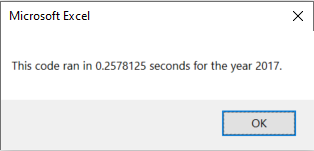
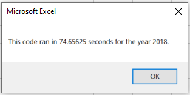

# MODULE-2-VBA: Stock Analyses using VBA Excel Macro

## Overview of Project
The parents of Steve asked for help in determining whether their investment plan was appropriately set on one company, "DQ". They had chosen this company because it produces "green" energy. We are attempting to broaden their outlook by analyzing starting and ending prices on stocks of 11 other companies.

## Results
We used stock prices from the years 2017 and 2018 for the 12 companies, including "DQ".

Below are the tables depicting beginning prices and overall return calculated for the year for each company's stock.

## Summary
There are very clear choices that will, based on the last 2 years of data, produce a nice return for Steve's parents.

